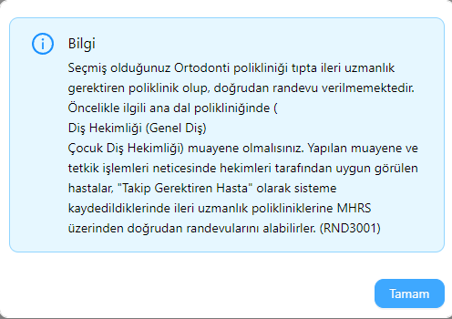

# MhrsRandevuFinder

**kod içerisindeki `IdentificationNum, Password, City, District, Clinic, Hospital, DateSelect` değerini kendi bilgileriniz ile değiştiriniz.**

**randevu bulunduğunda SMS gönderimi veyahutta MAIL gönderimini rahatlıkla yapabilirsiniz, ben burada sadece temel olarak ekrana yazdırdım. Bu kodu autorun ile her 10 dakikada 1 çalışacak şekilde ayarlar iseniz gayet işinize yarayabilir :)**

**bazı kliniklerde (örneğin ortodonti) doğrudan randevu verilememektedir, öncelikle kendiniz mhrs üzerinden kontrol edip ardından otomasyonu konfigürasyon edebilirsiniz.**

**önceki duruma istinaden örnek fotoğraf:**

